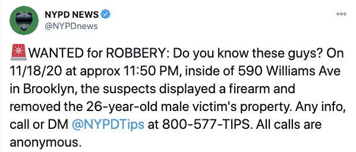
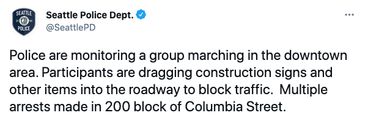

# SafeTweet
[SafeTweet Website](https://safteyai.web.app/)

A geographic heat map displaying instances of danger from police Twitter accounts.

Zoom in to a "hot" area and click a circle to see that individual Tweet, which contains instances of danger such as robberies, assaults, battery, etc.

## Danger Identification
First, SafeTweet detects whether or not a Tweet contains a dangerous incident.

For example, these two Tweets contain a dangerous incident

 

First, 1000 Tweets were queried using the [Twitter API](https://developer.twitter.com/en/docs). These Tweets were hand-labelled for instances of danger and then used to train a deep learning model with [Keras](https://keras.io/).

Furthermore, I used [Snorkel AI](https://www.snorkel.org/) weak supervision to generate labels for the model using danger keywords, keyword inflections, and [Vader](https://pypi.org/project/vaderSentiment/) sentiment analysis. 
I chose to use Weak supervision to clean and correlelate the Tweet data, since it is unlabelled and often messy. 

Finally, the model was fine tuned with Google's [BERT](https://github.com/google-research/bert) Natural Language Processing Transformer and achieved an accuracy of 93%.

## Heatmap
Using the Twitter API, over 50,000 Tweets were queried from police departments of major cities, including @NYPDnews, @SeattlePD, @SFPD, and many more. The location of the incidents were extracted from the Tweets using the [Google Geocoding API](https://developers.google.com/maps/documentation/geocoding/overview), and each Tweet was plotted at the location of the incident using the [MapBox API](https://docs.mapbox.com/mapbox-gl-js/example/heatmap-layer/).
